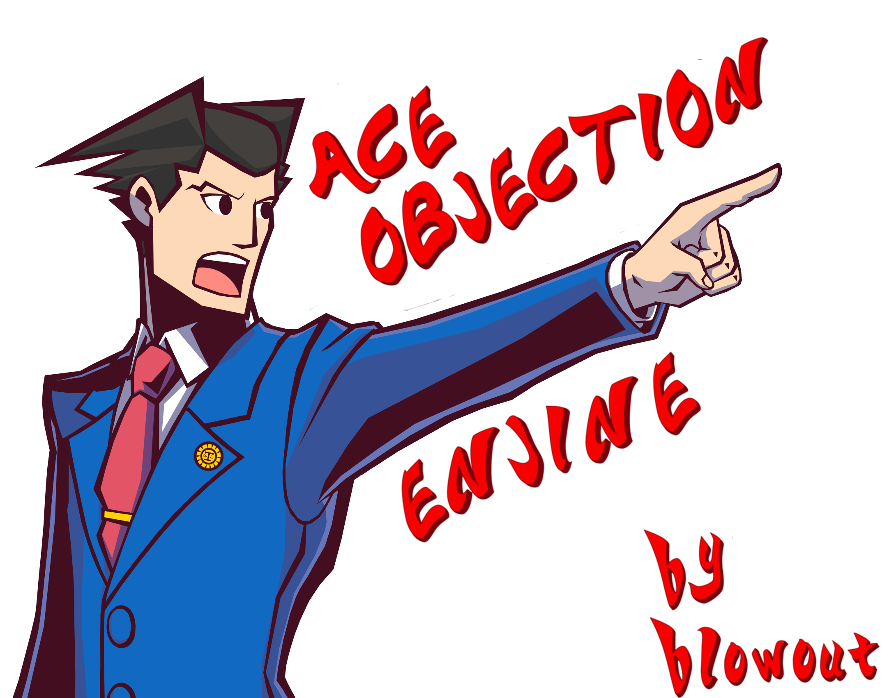

# [AceObjectionEngine.Net](https://www.nuget.org/packages/AceObjectionEngine.Net/) 
[](https://www.nuget.org/packages/AceObjectionEngine.Net/)
[](https://github.com/Dehs1244/AceObjectionEngine.Net/issues)
[](https://github.com/Dehs1244/AceObjectionEngine.Net/stargazers)
[](https://github.com/Dehs1244/AceObjectionEngine.Net/blob/master/LICENSE.md)
[](https://github.com/Dehs1244/AceObjectionEngine.Net/graphs/contributors)

<p align="center">

</p>

A <b>.Net library</b> for creating scenes based on text from the <b>Ace Attorney game</b>. The library is also based on a website dedicated to creating these scenes, [Objection.Lol](Objection.lol).
The library is based on its own animation engine for scene objects and can be extensible.

Animation based on `FFMpeg` and `System.Drawing`, but you can use your own animation library.

### **Don't forget about ⭐⭐⭐**
# Getting Started
## | Assets and Presets Loader
AceObjectionEngine requires **special presets** to create animated scenes. Such presets are arranged in a special hierarchical order for Preset Loader, you can download them from the **release package** or automatically using `Loader classes`

`Asset Loader` loads assets from the [Objection.Lol](Objection.lol) site, while `Preset Loader` loads the downloaded assets locally.

### • Example Character Asset Loader:

```csharp
CharacterLoader loader = new CharacterLoader(1);
var character = loader.Load();
```
After that, the asset will be converted as a preset and it can be loaded from the `Preset Loader`

### • Example Character Preset Loader:

```csharp
CharacterPreset preset = new CharacterPreset(1);
var character = preset.Load();
```
You can also create a **non-id asset or preset loader** to load all assets or presets. You **will not be able to download a specific asset or preset** with a specific id.
### • Example Non-id Background Asset Loader:
```csharp
BackgroundLoader loader = new BackgroundLoader();
var backgrounds = loader.LoadAll();
```
### • Example Non-id Character Preset Loader:
```csharp
CharacterPreset loader = new CharacterPreset();
var backgrounds = loader.LoadAll();
```

## | Loaders settings
Standard Asset and Preset loaders store all files locally on the computer. To configure file storage, you can use the `GlobalObjectionLoaderSettings` static class

### • Example configuration of assets loader:
```csharp
//Configuring existing Settings
GlobalObjectionLoaderSettings.ConfigureAssets(config => config.Overwrite = false);

//or create new
GlobalObjectionLoaderSettings.ConfigureAssets(new AssetsSettings()
{
    AssetsFolder = "Assets",
    Overwrite = true
});
```
Asset Settings Parameters:
|Name|Description|Default Value|
|------|:------:|:------:|
|AssetsFolder|Search path for Json asset descriptions|"Assets"
|BubblesJsonFile|The name of the Json file for the Bubble asset|"bubbles"
|CharactersJsonFile|The name of the Json file for the Character asset|"characters"
|Overwrite|When true overwrites existing presets|true
### • Example configuration of preset loader:
```csharp
//Configuring existing Settings
GlobalObjectionLoaderSettings.ConfigurePresets(config =>
{
    config.PresetsFolder = "Presets"
});

//or create new
GlobalObjectionLoaderSettings.ConfigurePresets(new PresetsSettings()
{
    PresetsFolder = "PresetsFolder"
});
```
Preset Settings Parameters:
|Name|Description|Default Value|
|------|:------:|:------:|
|PresetsFolder|The folder where the presets will be saved|"AceObjectionLib"
|StorageProvider|Implementing a Path Management Manager|LocalStorageProvider

## | Audio Analyzer
You can install another audio analyzer to analyze the audio. By default, FFMpeg analysis (FFProbe) is used in the library. Such an analyzer has its disadvantages, since it must save files locally for their analysis.

❗ Note that when installing an audio analyzer, you need to pass the function of creating a new instance of the analyzer.

### • Example of the install new **audio analyzer**:
```csharp
AudioAnalyzer.SetAnalyzer(() => new ExampleAudioAnalyzer());
```
### • Example of the getting **audio analyzer**:
```csharp
IAudioAnalyzer analyzer = AudioAnalyzer.Analyzer;
```

# Usage
## Build simple scene
The `ObjectionBuilder` is used to **build the animation**. It's easy and simple to build scenes and add various objects there.


Creating a builder for building simple scene:
```csharp
ObjectionBuilder builder = new ObjectionBuilder();
builder.CreateScene((scene) =>
{
    scene.AddCharacter(new CharacterPreset(2).LoadObject());
    scene.AddBackground(new BackgroundPreset(204).LoadObject()); //Cannot be changed in the future
    scene.AddAudio(new SoundPreset(13).LoadObject()); //Cannot be changed in the future

    scene.AddDialogue(new ChatBoxSettings()
    {
        Text = "Hello from AceObjectionEngine!"
    });

    scene.AddCharacter(new CharacterPreset(5).LoadObject());
    //Add Dialogue box to New Character
    scene.AddDialogue(new ChatBoxSettings()
    {
        Text = "I'm very confused..."
    });

    //Bubble after last Dialogue box
    scene.AddBubble(new BubblePresetLoader(1).LoadObject());

    scene.AddCharacter(new CharacterPreset(6).LoadObject());
    //Add two dialogue box to one character
    scene.AddDialogue(new ChatBoxSettings()
    {
        Text = "First Example Dialogue"
    });
    scene.AddDialogue(new ChatBoxSettings()
    {
        Text = "Second Example Dialogue"
    });
});
```
## | Build Multiple scenes

You can create more scenes, for example to change the music in the background or background.

Each scene stores and will not be able to change
-------------
- Background
- Audio (Music)

Creating a builder for building **multiple scenes**:
```csharp
ObjectionBuilder builder = new ObjectionBuilder();
builder.CreateScene((scene) =>
{
    scene.AddCharacter(new CharacterPreset(1).LoadObject());
    scene.AddBackground(new BackgroundPreset(103).LoadObject());
    scene.AddAudio(new SoundPreset(14).LoadObject());
    scene.AddDialogue(new ChatBoxSettings()
    {
        Text = "Text Dialogue!"
    });
}).CreateScene((scene) =>
{
    scene.AddCharacter(new CharacterPreset(2).LoadObject());
    scene.AddBackground(new BackgroundPreset(103).LoadObject());
    scene.AddAudio(new SoundPreset(13).LoadObject());
    scene.AddDialogue(new ChatBoxSettings()
    {
        Text = "Example text"
    });
    scene.AddCharacter(new CharacterPreset(5).LoadObject());
    scene.AddDialogue(new ChatBoxSettings()
    {
        Text = "Second example text"
    });
    scene.AddBubble(new BubblePresetLoader(1).LoadObject());
})
.CreateScene((scene) =>
{
    scene.AddCharacter(new CharacterPreset(4).LoadObject());
    scene.AddBackground(new BackgroundPreset(103).LoadObject());
    scene.AddDialogue(new ChatBoxSettings()
    {
        Text = "Some text"
    });
});
```
## | Objection helper classes
You can use static classes of `ObjectionCharacters`, `ObjectionBackgrounds`, `ObjectionMusic` and `ObjectionBubbles` for easy loading of presets.

```csharp
builder.CreateScene((scene) =>
{
    scene.AddCharacter(ObjectionCharacters.BellboyWitness);
    scene.AddBackground(ObjectionBackgrounds.AJJudge);
    scene.AddAudio(ObjectionMusic.Crossexamining);
    scene.AddBubble(ObjectionBubbles.Objection);

    scene.AddDialogue(new ChatBoxSettings()
    {
        Text = "Text Dialogue!"
    });
});
```

## | Customizable functions
When you adding any objects, you can configure the properties by changing the object parameters or setting values for any properties using **configuration methods**. You can **create objects** from scratch or modify ready-made objects using helper functions.

```csharp
builder.CreateScene((scene) =>
{
    //Modify character with settings
    scene.AddCharacter(ObjectionCharacters.PhoenixWrightDefense.WithSettings(new CharacterSettings()
    {
        Name = "Test Character",
        NamePlate = "Tester",
        Sex = AceObjectionEngine.Engine.Enums.BlipSexType.Female
    }));
    //Create new background
    scene.AddBackground(new Background(new BackgroundSettings()
    {
        Name = "Test Background",
        ImagePath = "Path/To/Background"
    }));
    //Change only pose of adding character
    scene.AddCharacter(ObjectionCharacters.MilesEdgeworthDefense.WithPose(701));
});
```

## | Animator and animation
When you have built your scene, you need to call the `Build<T>` method where `T` is the **type of animator** that was set by default.

❗ Note that animators implement the `IDisposable` interface, so **don't forget** to use the `using` keyword or the `Dispose` method.

```csharp
using var animator = builder.Build<ObjectionAnimator>();
animator.Animate();
animator.SaveAsFile("ExampleObjection.mp4");
```
Congratulations! The animation is ready and has been saved as a file.

# Components
## | Objection Objects
You can create your own objects to draw them on animation. Just inherit your class from the interface `IObjectionObject`.
```csharp
public class CustomObjectionObjectExample : IObjectionObject
{
    public int Id { get; }
    public ISpriteSource Sprite { get; }
    public IAudioSource AudioSource { get; }
    //The length reader of this component is used to calculate the sum of the entire animation
    public TimeSpan DurationCounter => TimeSpan.FromSeconds(4);
    public void Dispose()
    {
        //Dispose object
    }
    public void EndAnimation()
    {
        //Called when component end animation
    }
    public Task EndAnimationAsync()
    {
    }
    public void StartAnimation()
    {
        //Called when component start new animation
    }
    public Task StartAnimationAsync()
    {
    }
}
```
## | Branches in Rendering
You can also create branches in the rendering for any components. For example, such branches are used to animate the **poses** of characters. You can create your **own branches** for your components or add them to existing ones.
```csharp
public class RenderBranchExample : IRenderBranch
{
    public ISpriteSource State { get; set; }
    public TimeSpan Delay { get; set; }
    public TimeSpan Duration => //Set duration of this branch;
    public RenderActionConsequence Action(AnimationRenderContext sourceContext, ICollection<IAnimationObject> parallelObjects)
    {
        //Do things with this branch and return information about this branch to the main render
    }
}
```
As a result of the branch, you must return the data to the **main rander**: which objects should not be rendered, since this branch has already rendered them and what animation to render in the render.

# Inheritance and Extension
If you want to use your own library to analyze audio, build frames, or render, you can extend the classes of AceObjectionEngine. You can also fork the repository and make your own changes, thus replacing FFMpeg with another library.
## | Implementation of layer-by-layer rendering
By default, the library uses `FFMpegFrameRender` to render objects in the frame. You can implement your rendering system in two ways: by inheriting from `FrameRenderFactory` (it already contains an implementation of parallel rendering and helper methods) or inheriting from `IFrameRenderer<T>`, where T is `IAnimatorHierarchy` *(not recommended)*.

```csharp
public class FrameRenderImplementationExample : FrameRenderFactory
    {
        public override IAudioMixer CreateAudioMixer(TimeSpan timeLine)
        {
            //Creating Audio Mixer for Rendering
            //Example: 
            return new ExampleAudioMixer(timeLine);
        }

        public override Task RenderAllAsync()
        {
            //The end point of the render, collects all the frames into a single video
        }

        public override Task<IAudioSource> RenderAudioTickAsync(IAudioSource sprite, TimeSpan delay)
        {
            //Processing of single audio elements
        }

        public override Task<IAudioSource> RenderLayerAudioAsync(AnimationRenderContext audioSource)
        {
            //Processing of elements with an audio component
        }

        public override Task<ISpriteSource> RenderLayerSpriteAsync(ISpriteSource sprite)
        {
            //Some actions with sprite
        }
    }
```
To **install your layer** renderer, pass it to the settings of `ObjectionBuilder`
```csharp
ObjectionBuilder builder = new ObjectionBuilder(new ObjectionSettings()
{
    FrameRenderer = new FrameRenderImplementationExample()
});
```

## | Audio Analyzer Inheritance
The library has a **customizable audio analyzer**. FFMpeg analyzer (Probe) is used by default, but you can implement your own with abstract class `AudioAnalyzer` ***(Recommended)*** or with interface `IAudioAnalyzer`.

❗ Note that the properties of the `AudioAnalysisResult` class can only be initialized once
### • Example of the implementation of a new **audio analyzer**:
```csharp
public class ExampleAudioAnalyzer : AudioAnalyzer
    {
        protected override AudioAnalysisResult AnalyzeInner(string filePath) 
        {
            var mediaAnalyze = // some analyze
            var result = new AudioAnalysisResult();
            result.BitRate = mediaAnalyze.BitRate;
            result.Codec = mediaAnalyze.Codec;
            result.Format = mediaAnalyze.Format;
            result.Duration = mediaAnalyze.Duration;

            return result;
        }
    }
```
## | Sprite Implementation
By default, the library uses the `Sprite` and `GifSprite` class, which is based on the built-in `System.Drawings`. If you like, you can implement your own drawing library by inheriting the interface `ISpriteSource`.

❗ But all sprites depend on `Bitmap` class

```csharp
public class SpriteImplementationExample : ISpriteSource
    {
        public string Format { get; }

        public TimeSpan Duration { get; }

        public TimeSpan Delay { get; set; }

        public bool IsAnimated { get; }

        public int Height { get; }

        public int Width { get; }

        public Bitmap RawBitmap { get; }

        public ISpriteSource[] AnimateFrames()
        {
            //Some Animation
        }

        public object Clone()
        {
            //Clone Object
        }

        public void Dispose()
        {
            //Dispose Object
        }

        public ISpriteSource MergeSprite(ISpriteSource other)
        {
            //Merge with another sprite
        }
    }
```

## | Audio Implementation
By default, the library uses `AudioSource` class, which is based on `FFMpeg`. `IAudioSource` itself implements working with audio and has a full path to the source. You can implement your `AudioSource` using the interface `IAudioSource`

❗ The standard method of working with audio involves the use of a **temporary folder** into which intermediate processed audio is loaded.

```csharp
public sealed class AudioSourceImplementationExample : IAudioSource
    {
        public TimeSpan Offset { get; }

        public string FilePath { get; }

        public Stream Stream { get; }

        public string Codec { get; }

        public long BitRate { get; }

        public string Format { get; }

        public bool IsFixate { get; set; }

        public TimeSpan Duration { get; }

        public object Clone()
        {
            //Clone Media Object
        }

        public void Dispose()
        {
            //Dispose
        }

        public IAudioSource Merge(IAudioSource another)
        {
            //Merge with another Audio Source
        }

        public IAudioSource Mix(IEnumerable<IAudioSource> audioSources)
        {
            //Mix With Audio Sources
        }

        public void Save(string path)
        {
            //Save Audio Source
        }

        public IAudioSource Series(int loopTime)
        {
            //Loop Audio Source
        }

        public IAudioSource SetDuration(TimeSpan duration)
        {
            //Setting duration of audio source
        }
    }
```

## | Media Maker Implementation
Library components initialize audio and sprites through a class `MediaMaker`. In order not to rewrite the components, you can rewrite your media maker and set it. Makers are also used in *rendering*.

### • Example of the **audio maker**:
```csharp
//Audio Maker
public sealed class ExampleAudioSourceMaker : IMediaMaker<IAudioSource>
{
    public IAudioSource Make(string filePath) => new ExampleAudioSource(filePath);
    //Make Audio with Arguments
    public IAudioSource Make(string filePath, params object[] args) 
        => new ExampleAudioSource(filePath, args[0]);
}
```
### • Example of the **sprite maker**:
```csharp
//Audio Maker
public sealed class ExampleSpriteMaker : IMediaMaker<ISpriteSource>
{
    public ISpriteSource Make(string filePath) => new SpriteImplementationExample(filePath);

    public ISpriteSource Make(string filePath, params object[] args) => new SpriteImplementationExample(filePath, args[0]);
}
```
In order to install your creator, you need to use the method `SetSpriteMaker` and `SetAudioSourceMaker` and install the creation function of maker.
### • Example of the set **sprite maker**:
```csharp
MediaMaker.SetSpriteMaker(() => new ExampleSpriteMaker());
```
### • Example of the set **audio source maker**:
```csharp
MediaMaker.SetAudioSourceMaker(() => new ExampleAudioSourceMaker());
```

## | Audio Mixer Implementation
Audio mixers serve as the main mixing track of `IAudioSource` for a particular scene. If you are going to rewrite the rendering class, then you will have to use your own mixer or you can use the standard one `FFMpegAudioMixer`.

```csharp
public class ExampleAudioMixer : AudioMixer
    {
        public ExampleAudioMixer(TimeSpan timeLine) : base(timeLine)
        {
        }

        public override object Clone()
        {
            //Clone Object
        }

        public override IAudioSource Create()
        {
            //Create Audio Source from Audio Mixer
        }

        public override void CreateTimeLine()
        {
            //Create Time Line on Audio Mixer
        }

        public override void Merge(ref IAudioSource audioSource)
        {
            //Merge with Audio Source (Not mix, just append audio to Audio Mixer)
        }

        public override void Mix(ref IAudioSource audioSource)
        {
            //Mixing with Audio Source
        }
    }
```

# Code contributors
<a href="https://github.com/Dehs1244/AceObjectionEngine.Net/graphs/contributors">
  
</a>


### License

Copyright © 2022

Released under [MIT license](https://github.com/Dehs1244/AceObjectionEngine.Net/blob/master/LICENSE)